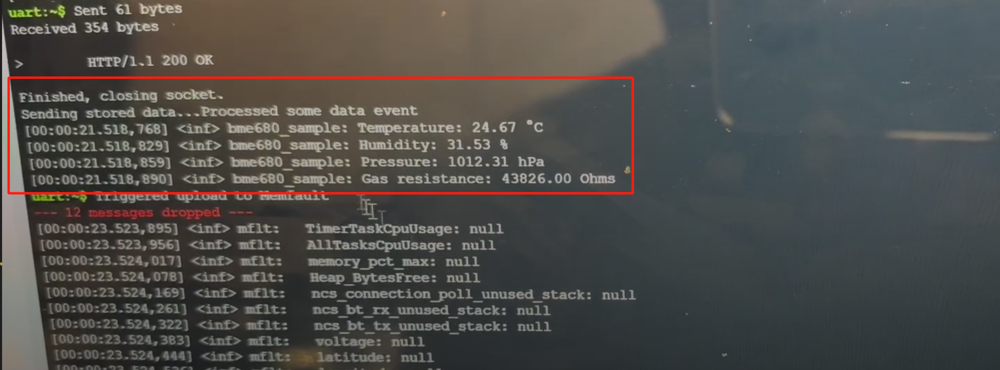

GitHub URL:  
https://github.com/ese5180/fp-f24-report-website-t08-release-anywhere.git

The repository containing the project code：  
https://github.com/ese5180/fp-f24-iot-venture-pitch-easypark.git

# 1. Changes throughout the project

## a. Target Market & Demographics

- __Initial Phase:__
  - __Focus:__ Primarily large event organizers for reducing maintenance costs and ensuring restroom cleanliness.  
  - __Geographical Focus:__ North America and Europe due to high demand and regulatory environments.  
  - __Market Size Estimation:__ General global mobile restroom market projected to reach over $15 billion by 2027.  

- __Changes Throughout the Project:__ 
  - __Detailed Breakdown:__ Provided a more granular market size analysis segmented by region and industry (e.g., events, construction, municipal).  
  - __Differentiation Strategies:__ Clearly articulated how the product stands out from competitors, particularly through advanced IoT integration and smart monitoring features.  

## b. Security, Hardware, & Software Requirements

- __Initial Phase:__  
  - __Security:__ Basic requirements for data privacy, integrity, tampering prevention, and secure storage.  
  - __Hardware:__ Utilization of Nordic Thingy:91 for GPS tracking, user volume monitoring via Hall effect sensors, and air quality detection via gas sensors.  
  - __Software:__ Managed GPS tracking, user-triggered alerts, and data transmission to the cloud via LTE-M/NB-IoT.  

- __Changes Throughout the Project:__  
  - __Security:__ Implemented end-to-end encryption for data in transit and at rest.  
  - __Upgraded Hardware Specifications:__ use nRF 9160dk instead of Nordic Thingy:91 (for the Memfault cellular ).
  - __Advanced Software Features:__ use nRF cloud to show the location of the device.

## c. Product Function & Components

- __Initial Phase:__  
  - __Primary Functions:__ 
  1) GPS tracking of portable toilets.  
  2) User volume monitoring via Hall effect sensors.  
  3) Air quality detection via gas sensors.  
  - __Core Components:__  Nordic Thingy:91, Hall effect sensors, gas sensors.  

- __Changes Throughout the Project:__  
  - The product features have hardly changed.  
  - Core Components: nRF 9160dk, bme680(as gas sensor), button(instead of Hall effect sensors)  

## d. Power & Cost Budgeting

- __Bulk Purchasing Discounts:__ Negotiated bulk purchasing agreements for components, reducing per-unit costs.  
- __Component Substitutions:__ Identified alternative suppliers or component models offering similar functionality at lower costs without compromising quality.  
- __Prototype to Production Scaling:__ Adjusted cost estimates to account for economies of scale as production moves from prototype to mass manufacturing.  

# 2. What parts of the project were successful

Detailed Software Requirements Specification  

__Why It's a Success:__  

1. __Real-Time Monitoring and Alerts:__ Implementing real-time GNSS tracking and alert systems ensures that maintenance staff can respond promptly to issues, enhancing operational efficiency.
Power Monitoring: Monitoring battery status and sending low-power alerts adds a layer of reliability, ensuring that the system remains functional when needed.

2. __System Administrators and Maintenance Staff:__ Clearly defining user roles ensures that the software meets the specific needs of different stakeholders, facilitating ease of use and effective management.  

3. __LTE-M/NB-IoT Connectivity:__ Utilizing reliable and low-power communication technologies ensures that your system can maintain continuous connectivity with minimal energy consumption.  

# 3. What parts of your project didn’t go well

Technical Integration and Hardware Challenges  

__Issues Faced:__

- __Sensor Reliability:__ Certain sensors (e.g., bme680) may have exhibited inconsistent performance in real-world conditions.  
- __Hardware Durability:__ The hardware components, including the nRF 9160dk, may have faced durability issues when deployed in outdoor environments.  

__Reasons:__

- __Environmental Factors:__ Exposure to extreme weather conditions, dust, and moisture could have affected sensor performance and hardware longevity.  
- __Integration Complexities:__ Integrating multiple sensors and ensuring seamless communication between them and the central unit might have led to unforeseen technical challenges.  

# 4.If you had to do it again, how might you change your development approach given the finite time and money resources?

## 4.1 Streamline Market Research and Targeting

__Primary Users:__ Concentrate on segments with immediate and high demand, such as large event organizers and rental companies, which can provide early revenue streams.

## 4.2 Optimize Hardware and Technology Choices

Choose sensors with established performance records and community support to ensure reliability and ease of integration.

## 4.3 Prioritize Security and Compliance Strategically

Ensure secure data transmission using standard encryption protocols without overcomplicating the architecture.

## 4.4 Simplify User Interface and Experience

Focus on displaying only the most critical information and functionalities in the user interface to reduce complexity.

# 5. Would you change your system design after this development cycle?

## 5.1 Wireless Communication Protocol

__Initial Choice:__ LTE-M/NB-IoT  

- __Pros:__  

  - __Wide Coverage:__ LTE-M and NB-IoT offer extensive coverage, making them suitable for outdoor deployments where mobile restrooms are frequently moved.  
  - __Low Power Consumption:__ Both protocols are designed for low power usage, extending the battery life of IoT devices.  
  - __Scalability:__ They support a large number of devices, facilitating the management of multiple restroom units.  

- __Cons:__  

  - __Latency:__ These protocols may introduce higher latency compared to alternatives like LoRaWAN, which could impact real-time data transmission.  
  - __Cost:__ LTE-M/NB-IoT can be more expensive in terms of data plans, especially for deployments with a large number of devices sending frequent updates.  
  - __Dependency on Cellular Networks:__ Reliance on existing cellular infrastructure may limit deployment in remote areas with poor network coverage.  

- __Recommended Changes:__  

  - __Wi-Fi 6 or 6E. Pros:__ Higher data rates and lower latency, beneficial for real-time monitoring and high-density deployments. Cons: Higher power consumption and reliance on local Wi-Fi infrastructure.

## 5.2 Sensors and Actuators

- __Recommended Changes:__ Infrared (IR) Sensors or Ultrasonic Sensors: For more reliable and accurate user occupancy detection, reducing dependency on door movements which may not always correlate with actual usage.

## 5.3 Target Market Alignment

- __Challenges Faced:__  
  - __Slower Adoption Rates:__ Potential customers were hesitant to adopt the new technology without sufficient education and proven benefits.  
  - __Market Misalignment:__ Some segments may have different priorities or requirements that were not fully addressed by the initial product design.  

- __Recommended Changes:__  
  - __Additional User Segments:__ Include smaller event organizers, temporary installations for disaster relief, outdoor recreational facilities, and private businesses (e.g., food trucks, pop-up shops).  
  - __Geographical Diversification:__ Consider expanding focus to regions with growing infrastructure projects or frequent events, such as Latin America and Southeast Asia.

## 5.4 Images of our MVP Device  

1. __Get the Device's Location__

2. __Measuring the Air Quality__

3. __Simulate Door Openings__

4. __Upload to Memfault__

5. __Device__

## 5.5 A video of the Core Product Function  

[Core Product Function](https://drive.google.com/file/d/11ecXrXUUzbfoC3DiXIjPaw3_1XLnYxOT/view?usp=sharing)

Note: The functionalities demonstrated in the video include:  

- Retrieving the device's location (longitude and latitude).
- Measuring the air quality inside the restroom.
- Recording the number of door openings in the restroom.
- Uploading all this data to Memfault.  
